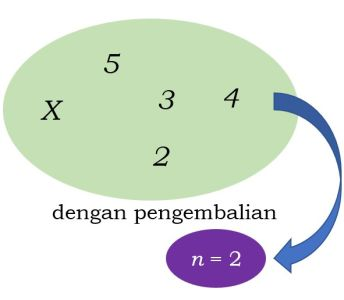
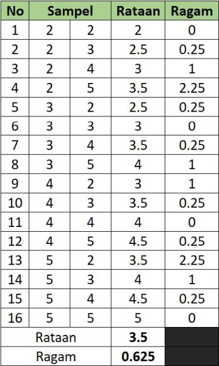
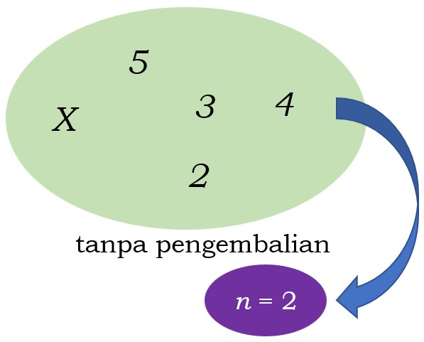
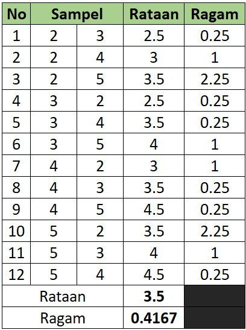

```{r xaringanExtra, echo=FALSE}
xaringanExtra::use_xaringan_extra(c("tile_view", "animate_css", "tachyons"))
```

```{r xaringan-panelset, echo=FALSE}
xaringanExtra::use_panelset()
```

```{r xaringan-scribble, echo=FALSE}
xaringanExtra::use_scribble()
```

```{r xaringan-logo, echo=FALSE}
xaringanExtra::use_logo(
  image_url = "Unsera.png"
)
```

```{r xaringanExtra-webcam, echo=FALSE}
xaringanExtra::use_webcam()
```

```{r xaringanExtra-search, echo=FALSE}
xaringanExtra::use_search(show_icon = TRUE)
```


.pull-left[
<br><br><br><br><br><br><br>


]

.pull-right[
<br>
# **.purple[Outline]**

- ##Sebaran penarikan contoh
- ##Nilai harapan dan ragam sebaran penarikan contoh
- ##Dalil Limit Pusat
- ##Sebaran student-t

]

---

.pull-left[

### **Sebaran Penarikan Contoh**

Mengidentifikasi sebaran suatu fungsi dari contoh
ketika diambil dari suatu populasi

.pull.center[




]
Populasi $(N=4)$ dan sampel $(n=2)$
$$X \sim \text{N}(\mu=3.5,\sigma^2=1.25)$$

]

.pull-right[

.pull.center[


]

]

---

.pull-left[
.pull.center[

]
]

.pull-right[

<br><br><br><br>
Populasi: $2, 3, 4, 5 \Rightarrow \mu=3.5 \text{ dan } \sigma^2=1.25$

Berdasarkan tabel di samping:

- $\bar{\bar{x}}=3.5=\mu \Rightarrow E(\bar{x})=\mu$

  $\bar{x}$ merupakan penduga tak bias untuk $\mu$

- $\text{Var}(\bar{x})=0.625=\dfrac{1.25}{2}=\dfrac{\sigma^2}{n}$


]

---

### Jika $X$ menyebar Normal, maka kombinasi linear dari $X$ juga menyebar Normal.<br>Karena $\bar{X}=\dfrac{1}{n}\sum\limits_{i=i}^{n}X_i$, maka $\bar{X}$ adalah kombinasi linear dari $X$ sehingga sebaran $\bar{X}$ menyebar Normal dengan:

- $E(\bar{X})=E\left(\dfrac{1}{n}\sum\limits_{i=1}^{n}X_i\right)=\dfrac{1}{n}\sum\limits_{i=1}^{n}E(X_i)=\dfrac{1}{n}\sum\limits_{i=1}^{n}\mu=\dfrac{1}{n}n\mu=\mu$
- $\text{Var}(\bar{X})=\text{Var}\left(\dfrac{1}{n}\sum\limits_{i=1}^{n}X_i\right)=\dfrac{1}{n^2}\sum\limits_{i=1}^{n}\text{Var}(X_i)=\dfrac{1}{n^2}\sum\limits_{i=1}^{n}\sigma^2=\dfrac{1}{n}n\sigma^2=\dfrac{\sigma^2}{n}$

.bg-washed-green.b--dark-green.ba.bw2.br3.shadow-5.ph4.mt5[

.pull.center[
### Jika $X \sim \text{N}(\mu,\sigma^2) \Rightarrow \bar{X} \sim \text{N}(\mu, \dfrac{\sigma^2}{n})$
]
]

---

.pull-left[

Bagaimana jika pengambilan contoh .red[**tanpa pengembalian**]?

.pull.center[



Populasi $(N=4)$ dan sampel $n=2$<br>
$$X \sim \text{N}(\mu=3.5,\sigma^2=1.25)$$


]
]

.pull-right[

.pull.center[
<br><br>

]

]

---

.pull-left[

.pull.center[
<br><br>

]

]

.pull-right[

<br><br><br><br>
Populasi: $2, 3, 4, 5 \Rightarrow \mu=3.5 \text{ dan } \sigma^2=1.25$

Berdasarkan tabel di samping:

$\bar{\bar{x}}=3.5=\mu$

dan

$\text{Var}(\bar{x})=0.4167=\dfrac{1.25}{2}\left(\dfrac{4-2}{4-1}\right)=\dfrac{\sigma^2}{n}\left(\dfrac{N-n}{N-1}\right)$

Pada pengambilan tanpa pengembalian:

$X \sim \text{N}(\mu,\sigma^2) \Rightarrow \bar{X} \sim \text{N}\left(\mu, \dfrac{\sigma^2}{n}\left(\dfrac{N-n}{N-1}\right)\right)$

]

---

.pull-left[
.pull.center[
### $X \sim \text{N}(\mu,\sigma^2)$

# $\big\Downarrow$

### $Z=\dfrac{X-\mu}{\sigma}$

# $\big\Downarrow$

### $Z \sim \text{N}(0,1)$
]
]

.pull-right[
.pull.center[
### $\bar{X} \sim \text{N}\left(\mu,\dfrac{\sigma^2}{n}\right)$

# $\big\Downarrow$

### $Z=\dfrac{\bar{X}-\mu}{\sigma/\sqrt{n}}=\dfrac{(\bar{X}-\mu)\sqrt{n}}{\sigma}$

# $\big\Downarrow$

### $Z \sim \text{N}(0,1)$
]
]

---

.pull-left[
.red[**Contoh**]

Sebuah perusahaan memproduksi bohlam. Bila umur bohlam itu menyebar normal dengan rata-rata 800 jam dan simpangan baku 40 jam, hitunglah peluang bahwa suatu contoh acak 16 bohlam akan mempunyai umur rata-rata kurang dari 775 jam.
___
Misalkan:<br> $X=$ umur bohlam (jam) $X \sim \text{N}(\mu=800, \sigma=40)$<br>
$n=16$

$$\begin{align*}
P(\bar{X}<775)&=P\left(Z<\dfrac{775-800}{40/\sqrt{16}}\right) \\
&=P(Z<-1.5) \\
&=0.0062
\end{align*}$$
]

.pull-right[
.red[**Contoh**]
<br><br><br>
Pengeluaran rumah tangga per bulan untuk konsumsi di suatu kabupaten diketahui menyebar normal dengan rataan 250 ribu rupiah dan simpangan baku 25 ribu rupiah.
1. Berapa persen rumah tangga yang pengeluaran per bulan untuk konsumsinya antara 225 ribu rupiah dan 265 ribu rupiah?
1. Jika diambil 10 rumah tangga sebagai contoh. Berapa persen rata-rata pengeluaran per bulan untuk konsumsinya antara 225 ribu rupiah dan 265 ribu rupiah?
1. Jika diambil 30 rumah tangga sebagai contoh. Berapa persen rata-rata pengeluaran per bulan untuk konsumsinya antara 225 ribu rupiah dan 265 ribu rupiah?
]

---

.pull.center[
# **Dalil Limit Pusat**
]

.bg-washed-green.b--dark-green.ba.bw2.br3.shadow-5.ph4.mt5[

### Dengan suatu sebarang sebaran populasi $X$, jika diambil contoh secara acak berukuran $n$ yang besar, maka $\bar{X}$ akan menyebar mendekati sebaran Normal dengan nilai tengah $\mu$ dan ragam $\sigma^2/n$
]

## $$X \sim \underset{n \rightarrow \infty}{\text{sebarang sebaran}} \Rightarrow \bar{X} \sim \text{N}\left(\mu,\dfrac{\sigma^2}{n}\right)$$

--

.pull.center[
### **Bagaimana jika .red[ragam populasi] $(\sigma^2)$ .red[tidak diketahaui]?**
]

---

.pull-left[

### .red[**Sebaran _t_-_student_**]

### Berdasarkan dalil limit pusat, untuk $n$ besar sebaran $\bar{X}$ dapat didekati oleh sebaran Normal dengan rata-rata $\mu$ dan ragam $\dfrac{\sigma^2}{n}$. Namun hal ini mensyaratkan ragam populasi $(\sigma^2)$ diketahui. 

### Apabila $\sigma^2$ tidak diketahui dan diganti dengan penduganya $s^2$, maka$$\dfrac{\bar{X}-\mu}{s/\sqrt{n}} \sim \text{t-student}(\text{db}=n-1)$$


]

.pull-right[
<br><br><br>
### Sebaran t mirip sebaran $N(0,1)$, hanya saja sebaran $t$ lebih bervariasi tergantung besarnya derajat bebas (db) $s^2$


]

---

.pull-left[

.red[**Contoh**]

Diketahui bahwa volume botol air menyebar normal dengan rataan 200 ml. Lalu diambil $n = 9$ contoh acak botol dengan simpangan baku volumenya 12 ml. Jika 5% rataan volume tertinggi dari botol tersebut akan ditolak, tentukan batas rataan volume botol yang masih diterima.
___

Misalkan peubah acak <br>
$X=$ volume botol air (ml)<br>
$X \sim \text{N}(\mu=200,\sigma^2)$ di mana $\sigma^2$ tidak diketahui <br>
contoh acak $n=9$ dan didapat $s=12$

$T=\dfrac{\bar{X}-\mu}{s/\sqrt{n}}$ berdistribusi t-student dengan derajat bebas $n-1$

$$\begin{align*}
P(T>t_{db=n-1})&=0.05 \\
1-P(T<t_{db=8})&=0.05 \\
P(T<t_{db=8})&=0.95
\end{align*}$$

]

.pull-right[

<br><br><br><br>
Mencari nilai $t_{db=8}$ sehingga nilai kumulatifnya $0.95$ bisa menggukan formula berikut di MS Excel

`=T.INV(0.95,8)`

dan didapatkan nilai $1.8595$

$$\begin{align*}
1.8595&=\dfrac{\bar{X}-\mu}{s/\sqrt{n}}=\dfrac{\bar{X}-200}{12/\sqrt{9}} \\
1.8595&=\dfrac{\bar{X}-200}{4} \\
\bar{X}-200 &= 4(1.8595) \\
\bar{X} &=4(1.8595)+200 \\
\bar{X} &=207.44
\end{align*}$$

Jadi batasan rataan volume botol yang masih diterima tidak lebih dari $207.44$
]
